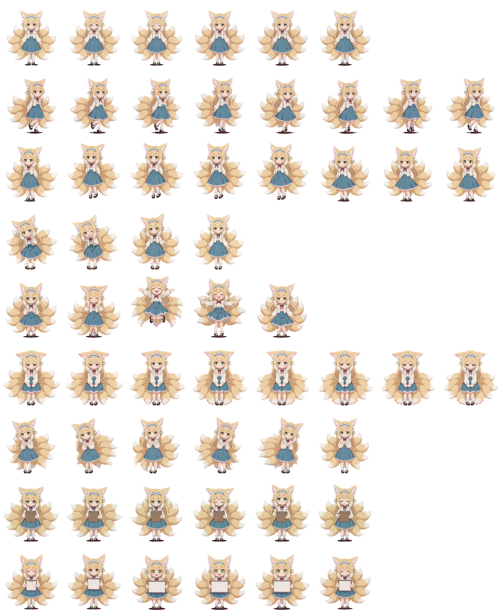

# Suzuran Codex Pet

一个用于 Codex 的《明日方舟》干员铃兰（Suzuran）桌宠。

本项目包含：

- 可直接加载到 Codex Pet 系统中的铃兰角色包
- 角色 Sprite Sheet 动画资源
- AI 视频生成到动画帧整理的制作工具
- 动画资源制作流程记录


## Preview




---

# Pet Structure

Codex Pet 本体位于：

```

pets/

```

目录：

```

pets/

```
├── pet.json

└── spritesheet.webp
```

````

其中：

## pet.json

用于描述 Pet 的基础信息：

```json
{
  "id": "suzuran",
  "displayName": "铃兰",
  "description": "铃兰（Suzuran），九尾狐与耳廓狐混血的可爱狐娘。",
  "spriteVersionNumber": 1,
  "spritesheetPath": "spritesheet.webp"
}
````

## spritesheet.webp

包含桌宠运行所需的动画 Sprite Sheet。

Codex Pet 加载该文件后即可显示铃兰角色。

---

# How It Was Made

铃兰 Pet 的制作流程如下：

```
角色基准图

        ↓

AI 视频生成

        ↓

视频关键帧提取

        ↓

人工筛选动画帧

        ↓

Sprite Sheet

        ↓

Codex Pet
```

与直接生成 Sprite Sheet 不同，本项目首先生成连续动画视频，
再从视频中选择合适帧制作桌宠动画。

这样可以更好保持：

* 角色脸型
* 发型
* 服装
* 身体比例
* 九尾结构
* 动作连续性

---

# Animation Pipeline

## 1. AI Video Generation

首先使用铃兰角色参考图生成短动画视频。

每个动作生成独立视频：

例如：

```
raw video/

├── idle.mp4
└── walk.mp4
```

视频负责提供：

* 身体运动
* 表情变化
* 尾巴运动
* 动作连续性

---

## 2. Video Keyframe Extraction

本项目提供视频关键帧提取工具：

```
video_keyframe_tool.py
```

功能：

* 视频读取
* 帧提取
* 关键帧选择
* 动画序列整理

运行环境：

```
requirements.txt
```

安装：

```bash
pip install -r requirements.txt
```

启动工具：

Windows:

```
start_video_tool.bat
```

或：

```bash
python video_keyframe_tool.py
```

---

# Project Structure

完整结构：

```
Suzuran-Codex-Pet/

│
├── pets/
│   │
│   ├── pet.json
│   │
│   └── spritesheet.webp
│
│
├── output_sequences/
│
│   └── extracted animation frames
│
│
├── raw video/
│
│   └── AI generated videos
│
│
├── video_workspace/
│
│   └── temporary processing files
│
│
├── video_keyframe_tool.py
│
├── start_video_tool.bat
│
└── requirements.txt
```

---

# Using The Pet

将：

```
pets/
```

复制到 Codex Pet 的 Pet 目录并更名即可。

Codex 会读取：

```
pet.json
```

并加载：

```
spritesheet.webp
```

作为桌宠动画资源。

---

# Current Animations

当前包含：

## Idle

待机动画：

* 呼吸
* 眨眼
* 耳朵轻微动作
* 九尾摆动

## Walk

行走动画：

* 可爱跳步
* 双手背后
* 左右脚交替
* 九尾跟随动作摆动

---

# Tools

## video_keyframe_tool.py

用途：

将 AI 视频转换为桌宠动画素材。

输入：

```
.mp4 video
```

输出：

```
animation frames
```

用于进一步制作：

```
spritesheet.webp
```

---

# Character Information

角色：

铃兰（Suzuran）

出处：

《明日方舟》（Arknights）

角色特点：

* 九尾狐与耳廓狐混血
* 金色头发
* 绿色眼睛
* 蓝白服装
* 九条狐尾

本项目仅用于：

* 个人学习
* Codex Pet 使用
* AI 动画制作展示

角色版权归《明日方舟》及相关版权方所有。

---

# License

Code:

MIT License

Character assets:

仅供非商业用途使用。
